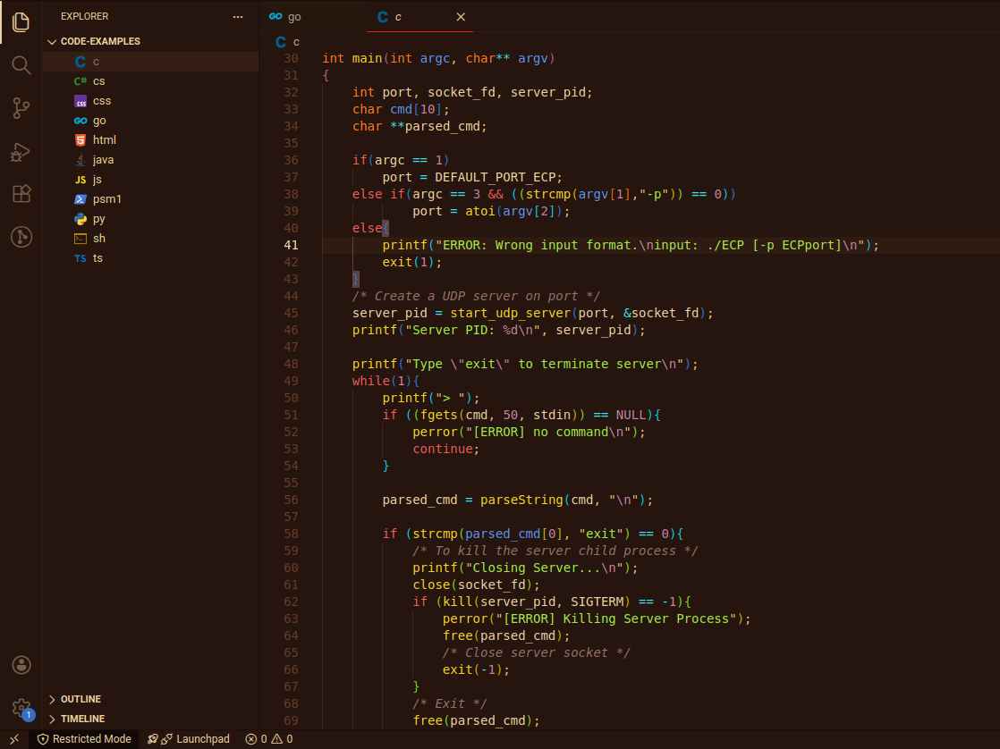
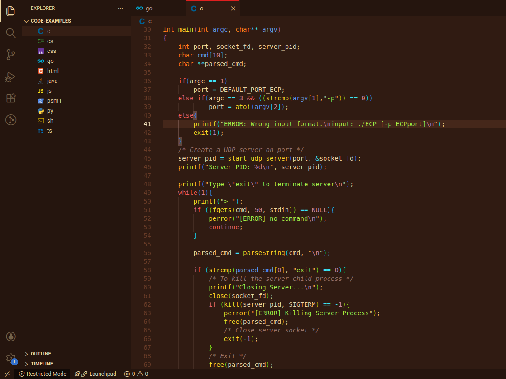
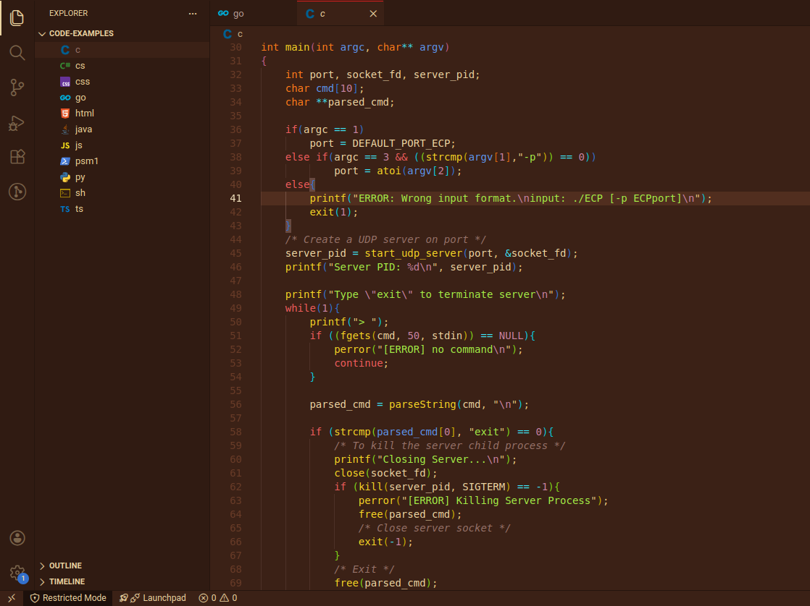
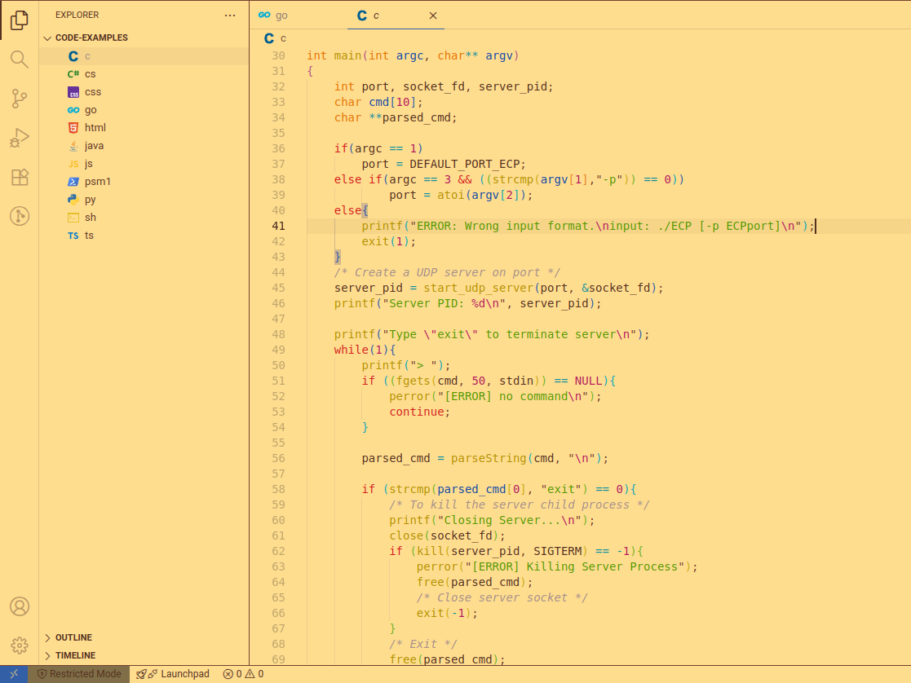
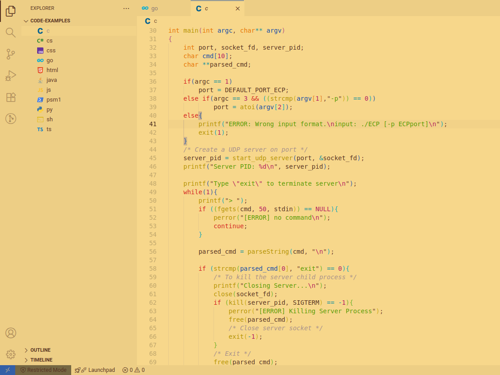
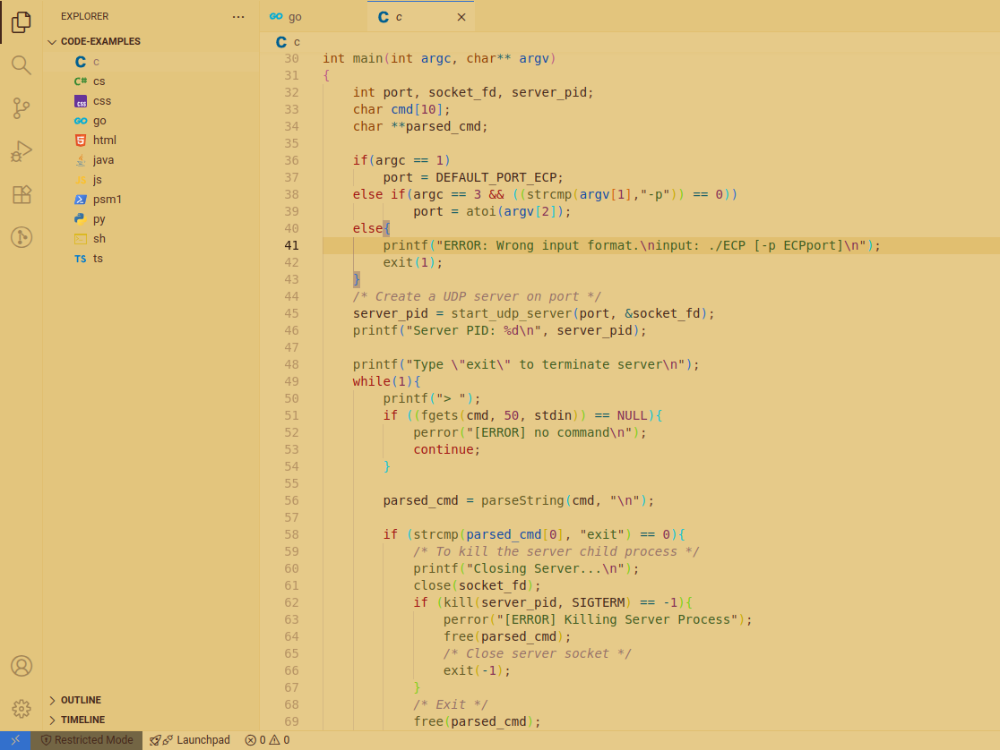

<h1 align="center">Capycocoa</h1>

No generic purple tinted theme. :kissing_heart:

 
 

<h3 align="center">Dark/Light Modes</h3>

| Intense | Regular | Pastel|
| :-: | :-: | :-: |
|  |  |  |
|  |  |  |
