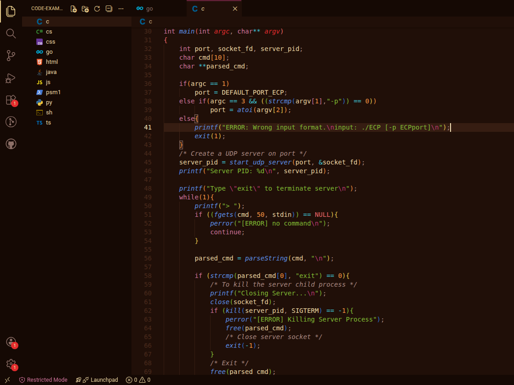
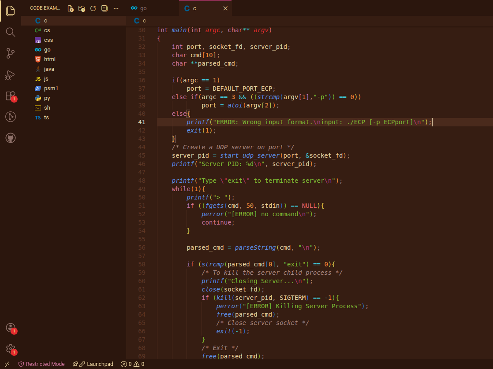
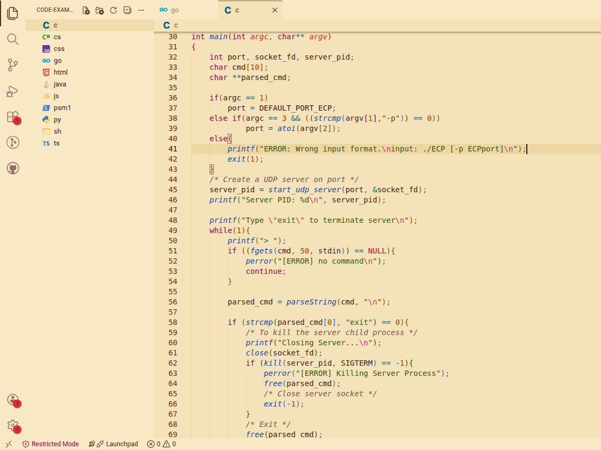

<h1 align="center">Capycocoa</h1>

No generic purple tinted theme. 😘  

<ul>
   <li>v3.0:
      <ul>
         <li>add Capycocoa HCF Dark and Light theme -> very dark ⚫ and very light ⚪ flat version of the theme which provide the highest contrast yet 🔲🔳</li>
      </ul>
   </li>
   <li>v2.0:
      <ul>
         <li>whole new bg color palette 🖌️ based on HSLuv with HSL interpolation 🧐 -> compared a real piece of chocolate 🍫 to my bg testing color palettes and chose the ones that looked the most natural to me</li>
         <li>syntax colors are now based on HSLuv grading, the contrast ratio of 4.5:1 is still ensured</li>
         <li>number of modes reduced to 3 because bloat 😌</li>
         <li>now supports the ErrorLens, GitLens and GitHub Pull Requests extension
      </ul>
   </li>
   <li>v1.2:
      <ul>
         <li>fixed light theme -> lighter bg-colors and better contrast fg-colors 🤘</li>
      </ul>
   </li>
   <li>v1.1:
      <ul>
         <li>now contains colors meeting the contrast ratio of 4.5:1 🔬</li>
      </ul>
   </li>
</ul>
 
 

<h3 align="center">Modes</h3>

| Zartbitter | Vollmilch | Edelweiß |
| :-: | :-: | :-: |
|  |  |  |
